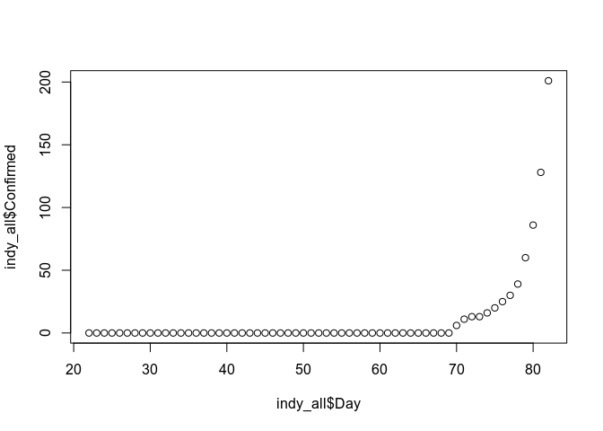
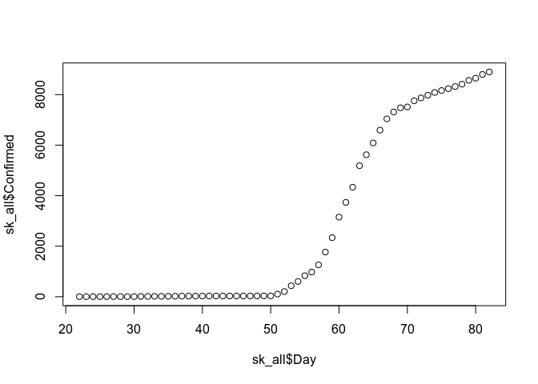

Covid19
================
Max O’Cull
3/23/2020

# COVID-19

Data sources can be found at [John Hopkin’s
Github](https://github.com/CSSEGISandData/COVID-19).

``` r
confirmed_raw <- read.csv("./time_series_19-covid-Confirmed.csv", header = TRUE)
recovered_raw <- read.csv("./time_series_19-covid-Recovered.csv", header = TRUE)
deaths_raw <- read.csv("./time_series_19-covid-Deaths.csv", header = TRUE)

indy_confirmed <- as.data.frame(t((confirmed_raw[confirmed_raw$Province.State == "Indiana", ])[,5:ncol(confirmed_raw)]))
indy_recovered <- as.data.frame(t((recovered_raw[recovered_raw$Province.State == "Indiana", ])[,5:ncol(recovered_raw)]))
indy_dead <- as.data.frame(t((deaths_raw[deaths_raw$Province.State == "Indiana", ])[,5:ncol(deaths_raw)]))
indy_all <- data.frame(seq(22, nrow(indy_confirmed) + 22 - 1), indy_confirmed, indy_recovered, indy_dead)
colnames(indy_all) <- c("Day", "Confirmed", "Recovered", "Dead")

sk_confirmed <- as.data.frame(t((confirmed_raw[confirmed_raw$Country.Region == "Korea, South", ])[,5:ncol(confirmed_raw)]))
sk_recovered <- as.data.frame(t((recovered_raw[recovered_raw$Country.Region == "Korea, South", ])[,5:ncol(recovered_raw)]))
sk_dead <- as.data.frame(t((deaths_raw[deaths_raw$Country.Region == "Korea, South", ])[,5:ncol(deaths_raw)]))
sk_all <- data.frame(seq(22, nrow(sk_confirmed) + 22 - 1), sk_confirmed, sk_recovered, sk_dead)
colnames(sk_all) <- c("Day", "Confirmed", "Recovered", "Dead")

sk_all$Confirmed <- sk_all$Confirmed / max(sk_all$Confirmed) # This is literally just a guess...

sk_fit <- glm(Confirmed ~ Day, data = sk_all, family = binomial)
```

    ## Warning in eval(family$initialize): non-integer #successes in a binomial
    ## glm!

``` r
summary(sk_fit)
```

    ## 
    ## Call:
    ## glm(formula = Confirmed ~ Day, family = binomial, data = sk_all)
    ## 
    ## Deviance Residuals: 
    ##       Min         1Q     Median         3Q        Max  
    ## -0.209710  -0.083779   0.007963   0.038130   0.178700  
    ## 
    ## Coefficients:
    ##              Estimate Std. Error z value Pr(>|z|)    
    ## (Intercept) -16.29510    4.73700  -3.440 0.000582 ***
    ## Day           0.25825    0.07479   3.453 0.000554 ***
    ## ---
    ## Signif. codes:  0 '***' 0.001 '**' 0.01 '*' 0.05 '.' 0.1 ' ' 1
    ## 
    ## (Dispersion parameter for binomial family taken to be 1)
    ## 
    ##     Null deviance: 54.02933  on 61  degrees of freedom
    ## Residual deviance:  0.63146  on 60  degrees of freedom
    ## AIC: 16.77
    ## 
    ## Number of Fisher Scoring iterations: 7

``` r
plot(sk_all$Day, sk_all$Confirmed, ylim=c(0, 1), xlim=c(0, 120))
sk_pred_range <- seq(22, 122, length.out = 100)
sk_pred <- predict(sk_fit, newdata = data.frame(Day = sk_pred_range), type = "response")
lines(sk_pred_range, sk_pred)
```

<!-- -->

``` r
# Indy
indy_all$Confirmed <- indy_all$Confirmed / 1000 # This is literally just a guess...

# If we optimize on the total confirmed cases (the 1000 magic value) such that 
# R^2 is maximized ~~we'll overfit~~ we'll find the most likely scenario.

indy_fit <- glm(Confirmed ~ Day, data = indy_all, family = binomial)
```

    ## Warning in eval(family$initialize): non-integer #successes in a binomial
    ## glm!

``` r
summary(indy_fit)
```

    ## 
    ## Call:
    ## glm(formula = Confirmed ~ Day, family = binomial, data = indy_all)
    ## 
    ## Deviance Residuals: 
    ##       Min         1Q     Median         3Q        Max  
    ## -0.070369  -0.012482  -0.001123  -0.000085   0.088017  
    ## 
    ## Coefficients:
    ##             Estimate Std. Error z value Pr(>|z|)
    ## (Intercept) -29.3280    29.5306  -0.993    0.321
    ## Day           0.3381     0.3685   0.918    0.359
    ## 
    ## (Dispersion parameter for binomial family taken to be 1)
    ## 
    ##     Null deviance: 3.494683  on 61  degrees of freedom
    ## Residual deviance: 0.045895  on 60  degrees of freedom
    ## AIC: 5.8228
    ## 
    ## Number of Fisher Scoring iterations: 11

``` r
plot(indy_all$Day, indy_all$Confirmed, ylim=c(0, 1), xlim=c(0, 120))
indy_pred_range <- seq(22, 122, length.out = 100)
indy_pred <- predict(indy_fit, newdata = data.frame(Day = indy_pred_range), type = "response")
lines(indy_pred_range, indy_pred)
```

<!-- -->
