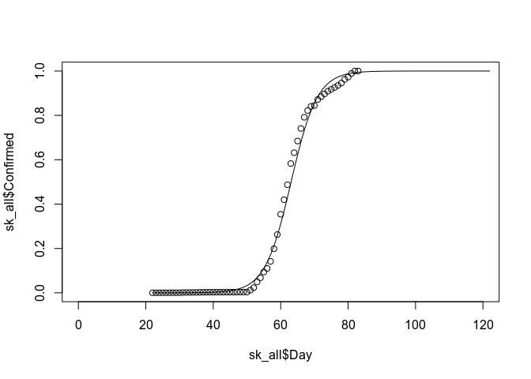
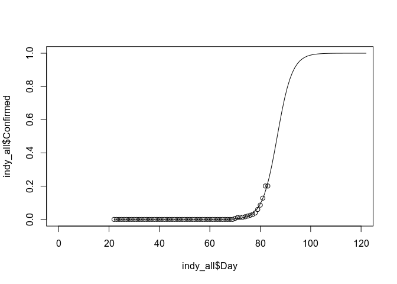

Covid19
================
Max O’Cull
3/23/2020

# COVID-19

Data sources can be found at [John Hopkin’s
Github](https://github.com/CSSEGISandData/COVID-19).

``` r
confirmed_raw <- read.csv("./time_series_19-covid-Confirmed.csv", header = TRUE)
recovered_raw <- read.csv("./time_series_19-covid-Recovered.csv", header = TRUE)
deaths_raw <- read.csv("./time_series_19-covid-Deaths.csv", header = TRUE)

indy_confirmed <- as.data.frame(t((confirmed_raw[confirmed_raw$Province.State == "Indiana", ])[,5:ncol(confirmed_raw)]))
indy_recovered <- as.data.frame(t((recovered_raw[recovered_raw$Province.State == "Indiana", ])[,5:ncol(recovered_raw)]))
indy_dead <- as.data.frame(t((deaths_raw[deaths_raw$Province.State == "Indiana", ])[,5:ncol(deaths_raw)]))
indy_all <- data.frame(seq(22, nrow(indy_confirmed) + 22 - 1), indy_confirmed, indy_recovered, indy_dead)
colnames(indy_all) <- c("Day", "Confirmed", "Recovered", "Dead")
indy_all
```

    ##          Day Confirmed Recovered Dead
    ## X1.22.20  22         0         0    0
    ## X1.23.20  23         0         0    0
    ## X1.24.20  24         0         0    0
    ## X1.25.20  25         0         0    0
    ## X1.26.20  26         0         0    0
    ## X1.27.20  27         0         0    0
    ## X1.28.20  28         0         0    0
    ## X1.29.20  29         0         0    0
    ## X1.30.20  30         0         0    0
    ## X1.31.20  31         0         0    0
    ## X2.1.20   32         0         0    0
    ## X2.2.20   33         0         0    0
    ## X2.3.20   34         0         0    0
    ## X2.4.20   35         0         0    0
    ## X2.5.20   36         0         0    0
    ## X2.6.20   37         0         0    0
    ## X2.7.20   38         0         0    0
    ## X2.8.20   39         0         0    0
    ## X2.9.20   40         0         0    0
    ## X2.10.20  41         0         0    0
    ## X2.11.20  42         0         0    0
    ## X2.12.20  43         0         0    0
    ## X2.13.20  44         0         0    0
    ## X2.14.20  45         0         0    0
    ## X2.15.20  46         0         0    0
    ## X2.16.20  47         0         0    0
    ## X2.17.20  48         0         0    0
    ## X2.18.20  49         0         0    0
    ## X2.19.20  50         0         0    0
    ## X2.20.20  51         0         0    0
    ## X2.21.20  52         0         0    0
    ## X2.22.20  53         0         0    0
    ## X2.23.20  54         0         0    0
    ## X2.24.20  55         0         0    0
    ## X2.25.20  56         0         0    0
    ## X2.26.20  57         0         0    0
    ## X2.27.20  58         0         0    0
    ## X2.28.20  59         0         0    0
    ## X2.29.20  60         0         0    0
    ## X3.1.20   61         0         0    0
    ## X3.2.20   62         0         0    0
    ## X3.3.20   63         0         0    0
    ## X3.4.20   64         0         0    0
    ## X3.5.20   65         0         0    0
    ## X3.6.20   66         0         0    0
    ## X3.7.20   67         0         0    0
    ## X3.8.20   68         0         0    0
    ## X3.9.20   69         0         0    0
    ## X3.10.20  70         6         0    0
    ## X3.11.20  71        11         0    0
    ## X3.12.20  72        13         0    0
    ## X3.13.20  73        13         0    0
    ## X3.14.20  74        16         0    0
    ## X3.15.20  75        20         0    0
    ## X3.16.20  76        25         0    1
    ## X3.17.20  77        30         0    2
    ## X3.18.20  78        39         0    2
    ## X3.19.20  79        60         0    2
    ## X3.20.20  80        86         0    2
    ## X3.21.20  81       128         0    4
    ## X3.22.20  82       201         0    6

``` r
sk_confirmed <- as.data.frame(t((confirmed_raw[confirmed_raw$Country.Region == "Korea, South", ])[,5:ncol(confirmed_raw)]))
sk_recovered <- as.data.frame(t((recovered_raw[recovered_raw$Country.Region == "Korea, South", ])[,5:ncol(recovered_raw)]))
sk_dead <- as.data.frame(t((deaths_raw[deaths_raw$Country.Region == "Korea, South", ])[,5:ncol(deaths_raw)]))
sk_all <- data.frame(seq(22, nrow(sk_confirmed) + 22 - 1), sk_confirmed, sk_recovered, sk_dead)
colnames(sk_all) <- c("Day", "Confirmed", "Recovered", "Dead")
sk_all
```

    ##          Day Confirmed Recovered Dead
    ## X1.22.20  22         1         0    0
    ## X1.23.20  23         1         0    0
    ## X1.24.20  24         2         0    0
    ## X1.25.20  25         2         0    0
    ## X1.26.20  26         3         0    0
    ## X1.27.20  27         4         0    0
    ## X1.28.20  28         4         0    0
    ## X1.29.20  29         4         0    0
    ## X1.30.20  30         4         0    0
    ## X1.31.20  31        11         0    0
    ## X2.1.20   32        12         0    0
    ## X2.2.20   33        15         0    0
    ## X2.3.20   34        15         0    0
    ## X2.4.20   35        16         0    0
    ## X2.5.20   36        19         0    0
    ## X2.6.20   37        23         0    0
    ## X2.7.20   38        24         1    0
    ## X2.8.20   39        24         1    0
    ## X2.9.20   40        25         3    0
    ## X2.10.20  41        27         3    0
    ## X2.11.20  42        28         3    0
    ## X2.12.20  43        28         7    0
    ## X2.13.20  44        28         7    0
    ## X2.14.20  45        28         7    0
    ## X2.15.20  46        28         9    0
    ## X2.16.20  47        29         9    0
    ## X2.17.20  48        30        10    0
    ## X2.18.20  49        31        12    0
    ## X2.19.20  50        31        12    0
    ## X2.20.20  51       104        16    1
    ## X2.21.20  52       204        16    2
    ## X2.22.20  53       433        16    2
    ## X2.23.20  54       602        18    6
    ## X2.24.20  55       833        18    8
    ## X2.25.20  56       977        22   10
    ## X2.26.20  57      1261        22   12
    ## X2.27.20  58      1766        22   13
    ## X2.28.20  59      2337        22   13
    ## X2.29.20  60      3150        27   16
    ## X3.1.20   61      3736        30   17
    ## X3.2.20   62      4335        30   28
    ## X3.3.20   63      5186        30   28
    ## X3.4.20   64      5621        41   35
    ## X3.5.20   65      6088        41   35
    ## X3.6.20   66      6593       135   42
    ## X3.7.20   67      7041       135   44
    ## X3.8.20   68      7314       118   50
    ## X3.9.20   69      7478       118   53
    ## X3.10.20  70      7513       247   54
    ## X3.11.20  71      7755       288   60
    ## X3.12.20  72      7869       333   66
    ## X3.13.20  73      7979       510   66
    ## X3.14.20  74      8086       510   72
    ## X3.15.20  75      8162       510   75
    ## X3.16.20  76      8236      1137   75
    ## X3.17.20  77      8320      1407   81
    ## X3.18.20  78      8413      1540   84
    ## X3.19.20  79      8565      1540   91
    ## X3.20.20  80      8652      1540   94
    ## X3.21.20  81      8799      1540  102
    ## X3.22.20  82      8897      2909  104

``` r
plot(indy_all$Day, indy_all$Confirmed)
```

<!-- -->

``` r
plot(sk_all$Day, sk_all$Confirmed)
```

<!-- -->

``` r
#fit <- nls(sk_all$Confirmed ~ SSlogis(sk_all$Day, Asym, xmid, scal), data = data.frame(sk_all$Day, sk_all$Confirmed))
# model <- glm(sk_all$Confirmed ~.,family=binomial(link='logit'),data=sk_all)

# summary(model)
```
